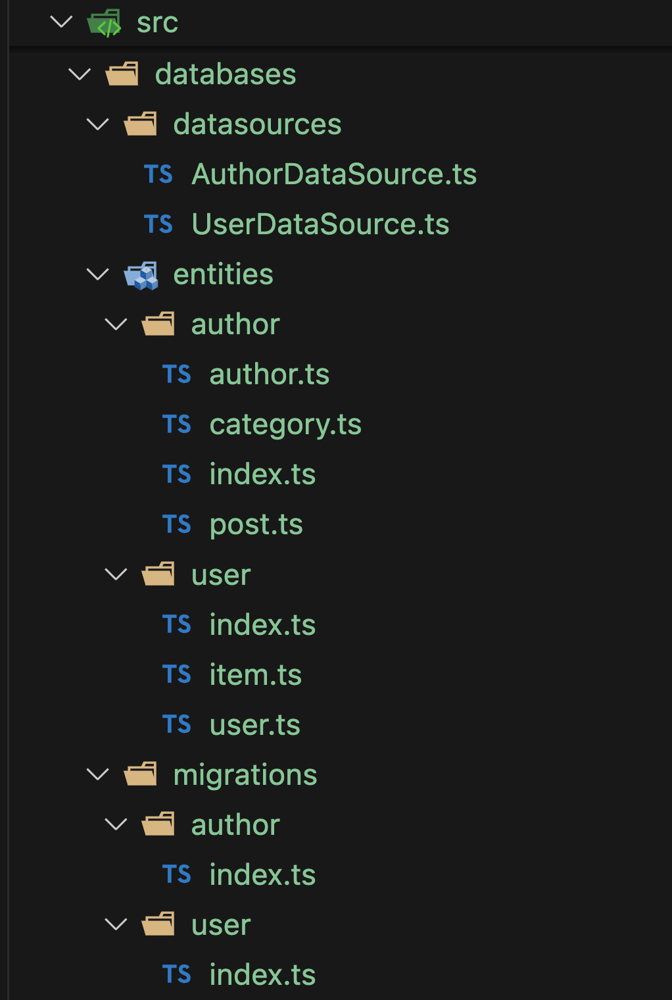

# Ionic 7 TypeOrm SQLite Database App Example Tutorial using React and @capacitor-community/sqlite
---

*last updated on February 19, 2024 by Quéau Jean Pierre*

In that tutorial we will learned how to create a Ionic7/React TypeOrm basic application and implement the @capacitor-community/sqlite plugin to store the data in a SQLite database.

The first part of the tutorial will concentrate on how to create that application and run it on a Web browser where the data will be stored on an Indexed database using sql.js and localForage modules.
Go to [Part 1 - Web - Table of Contents](#part-1---web---table-of-contents)

The application can be found at [Part-1/typeorm-ionic7-react-sqlite-app](https://github.com/jepiqueau/blog-tutorials-apps/tree/SQLite/main/Part-1/typeorm-ionic7-react-sqlite-app)

Thanks to the Ionic Team and their hard work to bring CAPACITOR 5, the second part will concentrate on native platforms (iOS and Android) and also on Electron platform.

Go to [Part 2 - Native - Table of Contents](#part-2---native---table-of-contents)

!!!!!!!!!!!!!!!!!!!!!!!!!!
!!!! Work in Progress !!!!
!!!!!!!!!!!!!!!!!!!!!!!!!!

The application can be found at [Part-2/typeorm-ionic7-react-sqlite-app](https://github.com/jepiqueau/blog-tutorials-apps/tree/main/SQLite/Part-2/typeorm-ionic7-react-sqlite-app)


## Part 1 - Web - Table of Contents

---
 - [Install New Ionic Application](#install-new-ionic-application)
 - [Install Required Packages](#install-required-packages)
 - [Create the Typeorm Directory Structure](#create-the-typeorm-directory-structure)
 - [Add Code to these Files](#add-code-to-these-files)
    - [Author Database](#author-database)
    - [User Database](#user-database)
    - [Capacitor SQLite Connection](#capacitor-sqlite-connection)
    - [Utilities](#utilities)
 - [Correcting a Bug in the TypeOrm Capacitor Driver](#correcting-a-bug-in-the-typeorm-capacitor-driver)
 - [Update Config and Package.json Scripts](#update-config-and-packagejson-scripts)
 - [Generate the Initial TypeOrm Migrations](#generate-the-initial-typeorm-migrations)
 - [Implementing the Application](#implementing-the-application)
    - [Main.tsx](#maintsx)
    - [App.tsx](#apptsx)
    - [AppMenu Component](#appmenu-component)
    - [Home Page](#home-page)
    - [AppLogo Component](#applogo-component)
    - [AppIntroText Component](#appintrotext-component)
    - [AppMenuButton Component](#appmenu-component)
 - [Run the Web SQLite App](#run-the-web-sqlite-app)
 - [Generate a New Migration on Author](#generate-a-new-migration-on-author)
    - [Entity Author](#entity-author)
    - [Add a Script in Package.json](#add-a-script-in-packagejson)
    - [Generate the Migration in TypeOrm CLI](#generate-the-migration-in-typeorm-cli)
    - [Add the Migration to the AuthorDataSource](#add-the-migration-to-the-authordatasource)
    - [Execute the Migration in the Web App](#execute-the-migration-in-the-web-app)
 - [Part 1 Conclusion](#part-1-conclusion)

---

### Install New Ionic Application

 - Install the latest version of Ionic CLI globally installed on your device, run the below command.

    ```bash
    sudo npm install -g @ionic/cli
    sudo npm install -g npm install g generate-react-cli
    ```

 - Create a new blank Ionic React app

    ```bash
    ionic start typeorm-ionic7-react-sqlite-app blank --type=react --capacitor
    ```

 - Go inside the project folder

    ```bash
    cd ./typeorm-ionic7-react-sqlite-app
    ```

### Install Required Packages

 - run the below commands

    ```bash
    npm install --save @capacitor-community/sqlite
    npm install --save reflect-metadata
    npm install --save typeorm
    npm install --save @capacitor/toast
    npm install --save @ionic/pwa-elements
    npm install --save-dev @types/node
    npm install --save-dev ts-node
    npm install --save-dev copyfiles
    npm install --save-dev unplugin-swc
    ```

### Create the Typeorm Directory Structure

 - With your favorite Editor, create the following directory structure under the src directory:

   

    The tutorial will utilize two datasources: Author and User.

    In the AuthorDataSource, three entities —Author, Category, and Post— will be defined.

    In the UserDataSource, two entities —User and Item— will be utilized.

 - Create two additional files under the `databases` directory:

    - `sqliteParams.ts` This file will handle the connection to the `@capacitor-community/sqlite` plugin.

    - `utilities.ts` This file will contain various utility methods.

    These files will provide essential functionalities and configurations for working with the SQLite plugin and implementing utility functions.

### Add Code to these Files

 - add `import "reflect-metadata";` in the main file of your App.

#### Author Database

 - `AuthorDataSource.ts`

 ```ts
 import { DataSource , type DataSourceOptions} from 'typeorm';
 import sqliteParams from '../sqliteParams';
 import * as entities from '../entities/author';
 import * as migrations from '../migrations/author';

 // Author Database Name
 const dbName = "react-sqlite-author"

 const dataSourceConfig: DataSourceOptions = {
  name: 'authorConnection',
  type: 'capacitor',
  driver: sqliteParams.connection,
  database: dbName,
  mode: 'no-encryption',
  entities: entities,
  migrations: migrations, //["../migrations/author/*{.ts,.js}"]
  subscribers: [],
  logging: [/*'query',*/ 'error','schema'],
  synchronize: false,     // !!!You will lose all data in database if set to `true`
  migrationsRun: false
 };
 export const dataSourceAuthor = new DataSource(dataSourceConfig);
 const authorDataSource = {
  dataSource: dataSourceAuthor,
  dbName: dbName
 };

 export default authorDataSource;
 ```

 - `UserDataSource.ts`

 ```ts
 import { DataSource , type DataSourceOptions} from 'typeorm';
 import sqliteParams from '../sqliteParams';
 import * as entities from '../entities/user';
 import * as migrations from '../migrations/user';

 // User Database Name
 const dbName = "react-sqlite-user"

 const dataSourceConfig: DataSourceOptions = {
  name: 'userConnection',
  type: 'capacitor',
  driver: sqliteParams.connection,
  database: dbName,
  mode: 'no-encryption',
  entities: entities,
  migrations: migrations, // ["../migrations/user/*.{js,ts}"],
  subscribers: [],
  logging: [/*'query',*/ 'error','schema'],
  synchronize: false,     // !!!You will lose all data in database if set to `true`
  migrationsRun: false
 };
 export const dataSourceUser = new DataSource(dataSourceConfig);
 const userDataSource = {
  dataSource: dataSourceUser,
  dbName: dbName
 };
 export default userDataSource;

 ```

 - Entity: `author.ts`

 ```ts
 import {Entity, PrimaryGeneratedColumn, Column, OneToMany, CreateDateColumn} from 'typeorm';
 import {Post} from './post';

 @Entity('author')
 export class Author {

  @PrimaryGeneratedColumn()
  id!: number;

  @Column()
  name!: string;

  @Column({nullable: true})
  company!: string;
  
  @Column({nullable: true})
  birthday!: string;

  @Column({unique: true})
  email!: string;

  @OneToMany(type => Post, post => post.author)
  posts!: Post[];
  
 }
 ```

 - Entity: `category.ts`

 ```ts
 import {Entity, PrimaryGeneratedColumn, Column} from 'typeorm';

@Entity('category')
 export class Category {

    @PrimaryGeneratedColumn()
    id!: number;

    @Column({unique: true})
    name!: string;

 } 
 ```

 - Entity: `post.ts`

 ```ts
 import {Entity, Column, PrimaryGeneratedColumn, ManyToOne, ManyToMany,
    JoinTable, type Relation, CreateDateColumn} from 'typeorm';
 import {Author} from './author';
 import {Category} from './category';

 @Entity('post')
 export class Post {
 @PrimaryGeneratedColumn()
 id!: number;

 @Column()
 title!: string;

 @Column('text')
 text!: string;

 @ManyToMany(type => Category, {
    cascade: ['insert']
 })
 @JoinTable()
 categories!: Category[];

 @ManyToOne(type => Author, author => author.posts, {
    cascade: ['insert']
 })
 author!: Relation<Author>;

 }
 ```

 - `entities/author/index.ts`

 ```ts
 import { Author } from './author';
 import { Category } from './category';
 import { Post } from './post';

 export { Author, Category, Post };
 ```

 - `migrations/author/index.ts`

 ```ts
 export {};
 ```

#### User Database

 - `UserDataSource.ts`

 ```ts
 import { DataSource , type DataSourceOptions} from 'typeorm';
 import sqliteParams from '../sqliteParams';
 import * as entities from '../entities/user';
 import * as migrations from '../migrations/user';

 // User Database Name
 const dbName = "react-sqlite-user"

 const dataSourceConfig: DataSourceOptions = {
  name: 'userConnection',
  type: 'capacitor',
  driver: sqliteParams.connection,
  database: dbName,
  mode: 'no-encryption',
  entities: entities,
  migrations: migrations, // ["../migrations/user/*.{js,ts}"],
  subscribers: [],
  logging: [/*'query',*/ 'error','schema'],
  synchronize: false,     // !!!You will lose all data in database if set to `true`
  migrationsRun: false
 };
 export const dataSourceUser = new DataSource(dataSourceConfig);
 const userDataSource = {
  dataSource: dataSourceUser,
  dbName: dbName
 };
 export default userDataSource;
 ```

 - Entity: `item.ts`

 ```ts
 import {Entity, Column, PrimaryGeneratedColumn, ManyToOne,
		type Relation} from 'typeorm';
 import {User} from "./user";

 @Entity('item')
 export class Item {
	@PrimaryGeneratedColumn()
	id!: number;

	@Column()
	name!: string;

	@Column({unique: true})
	phoneNumber!: number;

	@ManyToOne(type => User, user => user.items, {
		cascade: ['insert']
	})
	user!: Relation<User>;
  
 }
 ```

 - Entity: `user.ts`

 ```ts
 import {Entity, PrimaryGeneratedColumn, Column, OneToMany} from "typeorm"; 
 import {Item} from "./item";

 @Entity('user') 
 export class User {   

  @PrimaryGeneratedColumn()
  id!: number; 
  
  @Column()
  firstName!: string; 
  
  @Column()
  lastName!: string;

  @Column({unique: true})
  email!: string; 

  @OneToMany(type => Item, item => item.user)
  items!: Item[];

 }
 ```

 - `entities/user/index.ts`

 ```ts 
 import { Item } from './item';
 import { User } from './user';

 export { User, Item };
 ```

 - `migrations/user/index.ts`

 ```ts
 export {};
 ```

#### Capacitor SQLite Connection

 - `sqliteParams.ts`

 ```ts
 import { Capacitor } from '@capacitor/core';
 import { CapacitorSQLite, SQLiteConnection } from '@capacitor-community/sqlite';
 const sqliteConnection: SQLiteConnection = new SQLiteConnection(CapacitorSQLite);
 const sqlitePlugin = CapacitorSQLite;
 const platform: string = Capacitor.getPlatform();
 const sqliteParams = {
    connection: sqliteConnection,
    plugin: sqlitePlugin,
    platform: platform
 }
  export default sqliteParams;
```

#### Utilities

 - `utilities.ts`

 ```ts
 import { DataSource } from "typeorm";
 import authorDataSource from './datasources/AuthorDataSource';
 import userDataSource from './datasources/UserDataSource';
 import sqliteParams from './sqliteParams';

 export const initializeDataSources = (async () => {
    //check sqlite connections consistency
    await sqliteParams.connection.checkConnectionsConsistency()
    .catch((e) => {
        console.log(e);
        return {};
    });

    // Loop through the DataSources
    for (const mDataSource of [authorDataSource , userDataSource]) {
        // initialize
        await mDataSource.dataSource.initialize();
        if (mDataSource.dataSource.isInitialized) {
        // run the migrations
        await mDataSource.dataSource.runMigrations();
        }
        if( sqliteParams.platform === 'web') {
        await sqliteParams.connection.saveToStore(mDataSource.dbName);
        }                    
    } 
 });

 export const getCountOfElements =  (async (connection: DataSource,  entity:any): Promise<number> => {
    // Get the repository for your entity
    const repository = connection.getRepository(entity);
    // Use the count() method to query the count of elements in the table
    const count = await repository.count();
  
    return count;
 });
 ```


### Correcting a Bug in the TypeOrm Capacitor Driver

 - the bug is referenced "PRAGMA must run under query method in Capacitor sqlite #10687" in the typeorm/issues

 - create a `scripts` directory at the root of the App.

 - create a `modify-typeorm.cjs` file under this directory with:

 ```js
    const fs = require('fs');

    const filePath = './node_modules/typeorm/driver/capacitor/CapacitorQueryRunner.js';
    const lineToModify = 61;
    const replacementText = '    else if (["INSERT", "UPDATE", "DELETE"].indexOf(command) !== -1) {';

    fs.readFile(filePath, 'utf8', (err, data) => {
        if (err) {
            console.error('Error reading file:', err);
            return;
        }

        // Split data by line
        const lines = data.split('\n');

        // Modify the specific line
        if (lines.length >= lineToModify) {
            lines[lineToModify - 1] = replacementText; // Line numbers are 1-based
        } else {
            console.error('Line number to modify is out of range.');
            return;
        }

        // Join lines back together
        const modifiedData = lines.join('\n');

        // Write the modified data back to the file
        fs.writeFile(filePath, modifiedData, 'utf8', (err) => {
            if (err) {
                console.error('Error writing file:', err);
                return;
            }
            console.log('File modified successfully.');
        });
    });
 ```

### Update Config and Package.json Scripts

 - For Web application only the appID of the `capacitor.config.ts` must be amended with `YOUR_APP_ID`

 - For the `package .json` file 
    - add the following script below `"build": "tsc && vite build",`,

        ```json
        "copy:sql:wasm": "copyfiles -u 3 node_modules/sql.js/dist/sql-wasm.wasm public/assets",
        "build:web": "npm run copy:sql:wasm && npm run build",
        "typeorm:migration:generate:initialAuthor": "npx typeorm-ts-node-esm migration:generate src/databases/migrations/author/InitialAuthorPost -d src/databases/datasources/AuthorDataSource.ts",
        "typeorm:migration:generate:initialUser": "npx typeorm-ts-node-esm migration:generate src/databases/migrations/user/InitialUserPost -d src/databases/datasources/UserDataSource.ts",
        "postinstall": "node ./scripts/modify-typeorm.cjs"
        ```

    - modify the `"dev": "vite",` with

        ```json
        "dev": "npm run copy:sql:wasm && vite",
        ```
    
 - Open the `tsconfig.node.json` file  and add `"skipLibCheck": true,` in the "compilerOptions".

 - Open the `tsconfig.json` file:

    - modify "target": "ESNext" with `"target": "esnext"` in "compilerOptions"

    - add in "compilerOptions" 

    ```json
        "strictPropertyInitialization": false, // added
        "experimentalDecorators": true, //For DB ORM decorators
        "emitDecoratorMetadata": true, //For DB ORM decorators
    ```

    - before "include" add: 

    ```json
      "ts-node": {
        "esm": true,
        "experimentalSpecifierResolution": "node"
      },
    ```

 - Open the `vite.config.ts` file  and add

    - `import swc from 'unplugin-swc';` // Support using decorators without explicitly set ``types`` in ``TypeORM``


    - in the `plugin`section

    ```ts
    plugins:[
        ...

        legacy,
        swc.vite({
            exclude: [], //Default would exclude all file from ``node_modules``
            jsc: {
                minify: {
                compress: true,
                mangle: true,
                //Suggested by ``capacitor-sqlite``
                keep_classnames: true,
                keep_fnames: true,
                },
            },
        }),
    
        ...
    ]
    ```

### Generate the Initial TypeOrm Migrations

 - Execute the following commands: 

 ```bash
 npm run postinstall
 npm run build
 npm run typeorm:migration:generate:initialAuthor
 npm run typeorm:migration:generate:initialUser
 ```

 - Update the `migrations/index.ts` files by using the name of the migration's file created

    - `migrations/author/index.ts`

    ```ts
    import {InitialAuthorPost1708269296396} from './1708269296396-InitialAuthorPost';
    export {InitialAuthorPost1708269296396};
    ```

   - `migrations/user/index.ts`

   ```ts
   import {InitialUserPost1708269424717} from './1708269424717-InitialUserPost';
    export {InitialUserPost1708269424717};
   ```

### Implementing the Application

 The setup for TypeORM is almost complete. We still need to initialize the DataSources and execute the migrations. This is implemented in the `main.ts` file.

#### Main.tsx

 - Open the `main.tsx` file and replace the code with:

 ```ts
 import "reflect-metadata";
 import React from 'react';
 import { createRoot } from 'react-dom/client';
 import App from './App';

 import { JeepSqlite } from 'jeep-sqlite/dist/components/jeep-sqlite';
 import { defineCustomElements as pwaElements} from '@ionic/pwa-elements/loader';
 import sqliteParams from './databases/sqliteParams';
 import {initializeDataSources} from './databases/utilities';

 pwaElements(window);
 customElements.define('jeep-sqlite', JeepSqlite);

 const rootRender = async () => {

  await initializeDataSources();

  const container = document.getElementById('root');
  const root = createRoot(container!);
  root.render(
    <React.StrictMode>
      <App />
    </React.StrictMode>
  );
 }
 if (sqliteParams.platform !== "web") {
    rootRender();
 } else {
    window.addEventListener('DOMContentLoaded', async () => {
      // Create the "jeep-sqlite" web component
      const jeepEl = document.createElement("jeep-sqlite");
      // Set the style for the button
      //to pick or save the database from/to local disk
      jeepEl.buttonOptions = '{"backgroundColor":"#fb2a2a", "top":"70%","fontSize":"1.1em"}';
      document.body.appendChild(jeepEl);
      customElements.whenDefined('jeep-sqlite').then(async () => {
        await sqliteParams.connection.initWebStore();
        rootRender();
      })
      .catch ((err) => {
        console.log(`Error: ${err}`);
        throw new Error(`Error: ${err}`)
      });
    });
 }

 ```

#### App.tsx

 The App will feature a menu that allows users to navigate from the Home page to either the Author page or the User page, and then return to the Home page.

 The Home page will display a logo and an introduction text using the AppLogo and AppIntroText components, respectively.

 The Author page will allow users to create authors, categories, and posts in the database. It will then display them using the PostList component and provide an icon button for saving the database to the local disk.

 The User page will enable users to create users and items in the database. Subsequently, it will showcase them using the UserList component and furnish an icon button for saving the database to the local disk.

 - Open the `App.tsx` file and make the following changes:

 ```ts
 import React from 'react';
 import UsersPage from './pages/UsersPage';
 import AuthorsPage from './pages/AuthorsPage';
 import AppMenu from './components/AppMenu/AppMenu';
 ```

 and 

 ```ts 
 const App: React.FC = () => {
    return (
        <IonApp>
        <IonReactRouter>
            <AppMenu />
            <IonRouterOutlet id="main-content">
            <Route exact path="/home">
                <Home />
            </Route>
            <Route exact path="/">
                <Redirect to="/home" />
            </Route>
            <Route path="/users" component={UsersPage} />
            <Route path="/authors" component={AuthorsPage} />
            </IonRouterOutlet>
        </IonReactRouter>
        </IonApp>
    );
 };
```

#### AppMenu Component

 ```bash
    npx generate-react-cli component AppMenu 
 ```

 Answer to the question to get only the component file and a component.css file and not lazy loaded.

 - Open the `AppMenu.css` and copy

 ```css
 .AppMenu  {
    .menu-ion-label {
        color:antiquewhite;
        font-size: 1.1rem;
        font-weight: Bold;
        font-style: italic;
    }
    ion-button {
        --background: transparent;
        --color: initial;
        font-size: 0.8rem;
    }
 }
 ```

 - Open the `AppMenu.tsx` and replace

 ```ts
 import React from 'react';
 import './AppMenu.css';
 import { IonMenu, IonHeader, IonToolbar, IonTitle, IonContent, IonLabel,
         IonList, IonItem, IonButton, IonItemGroup, IonItemDivider} from '@ionic/react';

 interface AppMenuProps {}

 const AppMenu: React.FC<AppMenuProps> = () => {
  const closeMenu = () => {
    const menu = document.querySelector('ion-menu');
    menu!.close();
  };
  return (
    <IonMenu className="AppMenu" side="end" contentId="main-content">
      <IonHeader>
        <IonToolbar>
          <IonTitle>Menu Content</IonTitle>
        </IonToolbar>
      </IonHeader>
      <IonContent>
        <IonList>
          <IonItemGroup>
            <IonItemDivider>
              <IonLabel class="menu-ion-label">Authors DB</IonLabel>
            </IonItemDivider>
            <IonItem onClick={closeMenu}>
              <IonButton size="default" routerLink="/authors" expand="full">Author's List</IonButton>
            </IonItem>
          </IonItemGroup>
          <IonItemGroup>
            <IonItemDivider>
              <IonLabel class="menu-ion-label">Users DB</IonLabel>
            </IonItemDivider>
            <IonItem onClick={closeMenu}>
              <IonButton size="default" routerLink="/users" expand="full">User's List</IonButton>
            </IonItem>
          </IonItemGroup>
          {/* ... other menu items */}
        </IonList>
      </IonContent>
    </IonMenu>
  )
 };
 export default AppMenu;
 ```

#### Home Page

 - Open the Home.tsx file and update the code with

 ```ts
 import React from 'react';
 import { IonContent, IonHeader, IonPage, IonTitle, IonToolbar } from '@ionic/react';
 import AppMenuButton from '../components/AppMenuButton/AppMenuButton';
 import AppLogo from '../components/AppLogo/AppLogo';
 import AppIntroText from '../components/AppIntroText/AppIntroText';

 import './Home.css';

 const Home: React.FC = () => {
  return (
    <IonPage>
      <IonHeader>
        <IonToolbar>
          <AppMenuButton />
          <IonTitle>Home</IonTitle>
        </IonToolbar>
      </IonHeader>
      <IonContent fullscreen>
        <IonHeader collapse="condense">
          <IonToolbar>
            <IonTitle size="large">Home</IonTitle>
          </IonToolbar>
        </IonHeader>
        <div id="container">
          <AppLogo />
          <AppIntroText />
        </div>
      </IonContent>
    </IonPage>
  );
 };

 export default Home;

 ```

 - Delete the `ExploreContainer.tsx` and `ExploreContainer.css` files under the `src/components` directory

#### AppLogo Component


 - Create an `AppLogo` React component

    ```bash
    npx generate-react-cli component AppLogo 
    ```

 - In your Editor replace the code of `AppLogo/AppLogo.tsx` with 

 ```ts
 import React from 'react';
 import './AppLogo.css';

 interface AppLogoProps {}

 const AppLogo: React.FC<AppLogoProps> = () => (
    <div className="AppLogo">
        
    </div>
 );

 export default AppLogo
 ```
 Obviously use your own logo and store it in the `public/assets` folder.

 - In your Editor replace the code of `AppLogo/AppLogo.css` with 

 ```css
 .AppLogo {
    width: 100%;
    max-height: 200px;
    display: flex;
    justify-content: center;
 }
 ```

#### AppIntroText Component

 - Create an `AppIntroText` React component

    ```bash
    npx generate-react-cli component AppIntroText 
    ```

 - In your Editor replace the code of `AppIntroText/AppIntroText.tsx` with 

 ```ts
 import React from 'react';
 import './AppIntroText.css';

 interface AppIntroTextProps {}

 const AppIntroText: React.FC<AppIntroTextProps> = () => (
  <div className="AppIntroText">
    <div id="app-intro-header">
      <h3>
        Welcome to the Ionic7/React/Vite TypeOrm SQLite Database App Example Tutorial
      </h3>
      <h4>using @capacitor-community/sqlite</h4>
    </div>
    <div id="app-intro-content">
      <p>The purpose is to demonstrate the basic setup of the App. </p>
      <p>The CRUD methods could be implemented from there</p>
    </div>
  </div>
 );

 export default AppIntroText;
 ```

 Fill free to put whatever text you would like to see

 - In your Editor replace the code of `AppIntroText/AppIntroText.css` with 

 ```css
 .AppIntroText {
    display: flex;
    flex-direction: column;
 }
 #app-intro-header {
    margin-top: 10%;
    margin-left: 5%;
    margin-right: 5%;
    text-align: center;
    h3 {
        font-size: 1.1rem;  
    } 
    h4 {
        font-size: 1.1rem; 
        font-weight: 200;
    }    
 }
 #app-intro-content {
    padding: 0.5%;
 }
 ```

#### AppMenuButton Component

 - Create an `AppMenuButton` React component

    ```bash
    npx generate-react-cli component AppMenuButton 
    ```

 - In your Editor replace the code of `AppMenuButton/AppMenuButton.tsx` with 

 ```ts
 import React from 'react';
 import './AppMenuButton.css';
 import { IonMenuButton } from '@ionic/react';

 interface AppMenuButtonProps {}

 const AppMenuButton: React.FC<AppMenuButtonProps> = () => {
  return (
    <IonMenuButton slot="end" />
  )
 };

 export default AppMenuButton;
 ```

#### Authors Page

 - Under `src/pages` directory create the following files `AuthorsPage.css` and `AuthorsPage.tsx`.

 - Open the `AuthorsPage.tsx`

 ```ts
 import React, { useState } from 'react';
 import { IonContent, IonHeader, IonPage, IonTitle, IonToolbar, IonCard,
        IonButtons, IonBackButton, IonIcon, useIonViewWillEnter } from '@ionic/react';
 import './AuthorsPage.css';
 import { save } from 'ionicons/icons';

 import sqliteParams from '../databases/sqliteParams';
 import authorDataSource from '../databases/datasources/AuthorDataSource';
 import { Post } from '../databases/entities/author/post';
 import { Category } from '../databases/entities/author/category';
 import { Author } from '../databases/entities/author/author';
 import { getCountOfElements } from '../databases/utilities';
 import PostList from '../components/PostList/PostList';

 const AuthorsPage: React.FC = () => {
    const [initialRef, setInitialRef] = useState(false);
    const [isWeb, setIsWeb] = useState(false);
    const [authors, setAuthors] = useState<Author[]>([]);
    const [categories, setCategories] = useState<Category[]>([]);
    const [posts, setPosts] = useState<Post[]>([]);
    let errMess = '';

    const connection = authorDataSource.dataSource;
    const database = authorDataSource.dbName;

    const createAuthor = async (name:string, email:string): Promise<Author> => {
        const author = new Author();
        author.name = name;
        author.email = email;
        const authorRepository = connection.getRepository(Author);
        let authorToUpdate = await authorRepository.findOne({
            where: {
            email: author.email,
            },
        });
        if (authorToUpdate != null) {
            author.id = authorToUpdate.id;
        }
        await authorRepository.save(author);
        return author;
    }; 
    const createCategory = async (name: string): Promise<Category> => {
        const category = new Category();
        category.name = name;
        const categoryRepository = connection.getRepository(Category);
        let categoryToUpdate = await categoryRepository.findOne({
          where: {
            name: category.name,
          },
        });
        if (categoryToUpdate != null) {
            category.id = categoryToUpdate.id;
        }
        await categoryRepository.save(category);
        return category;
    }; 
    const createPost = async (title: string, text: string, author:Author,
                              categories: Category[]): Promise<void> => {

        const post = new Post();
        post.title = title;
        post.text = text;
        post.author = author;
        post.categories = categories;
        const postRepository = connection.getRepository(Post);
        let postToUpdate = await postRepository.findOne({
          where: {
            title: post.title,
          },
        });
        if (postToUpdate != null) {
            post.id = postToUpdate.id;
        }
        await postRepository.save(post);
        return ;
    }; 
    const initializePosts = async () => {
        try {
            setIsWeb(sqliteParams.platform === 'web' ? true : false);
            const countAuthor = await getCountOfElements(connection, Author);
            if (countAuthor === 0 ) {
                // Create some Authors
                const author1 = await createAuthor('JeepQ', 'jeepq@example.com');
                const author2 = await createAuthor('Rosenwasser', 'rosenwasser@example.com');
                // Create some Categories
                const categ1 = await createCategory('Typescript');
                const categ2 = await createCategory('Programming');
                const categ3 = await createCategory('Tutorial');
                // Create some Posts
                await createPost('Announcing TypeScript 5.0',
                'This release brings many new features, while aiming to make TypeScript smaller, simpler, and faster...',
                author2,[categ1,categ2])
                await createPost('Ionic 7 SQLite Database CRUD App Example Tutorial using Angular and @capacitor-community/sqlite',
                'In that tutorial we will learned how to create a Ionic7/Angular basic CRUD application and implement the @capacitor-community/sqlite plugin to store the data in a SQLite database...',
                author1,[categ1,categ2,categ3])
                await createPost('Ionic 7 VideoPlayer App Example Tutorial using Angular and capacitor-video-player plugin',
                'In this tutorial, we will learn how to create a simple Ionic7/Angular video player application by implementing the capacitor-video-player plugin to display a list of videos with some data and play a selected video in fullscreen mode...',
                author1,[categ1,categ2,categ3])
                if (isWeb) {        
                    await sqliteParams.connection.saveToStore(database);
                }
            }
            setAuthors(await connection.manager.find(Author));
            setCategories(await connection.manager.find(Category));
            setPosts(await connection
                    .createQueryBuilder(Post,'post')
            .innerJoinAndSelect('post.author', 'author')
            .innerJoinAndSelect('post.categories', 'categories')
            .orderBy('author.name,post.title')
            .getMany());
            
        } catch (e) {
            console.log((e as any).message);
            errMess = `Error: ${(e as any).message}`;
        }               
    };
              
    const handleSave = (async () => {
        await sqliteParams.connection.saveToStore(database);
        // write database to local disk for development only
        await sqliteParams.connection.saveToLocalDisk(database);

    });

    useIonViewWillEnter( () => {
        if(initialRef === false) {
            initializePosts();
            setInitialRef(true);
          }

    });

    return (
        <IonPage className="AuthorPage">
            <IonHeader>
                <IonToolbar>
                <IonTitle>Authors DB</IonTitle>
                <IonButtons slot="start">
                    <IonBackButton text="home" defaultHref="/home"></IonBackButton>
                </IonButtons>
                {isWeb && (
                    <IonButtons slot="end">
                        <IonIcon icon={save} onClick={handleSave}></IonIcon>
                    </IonButtons>
                )}
                </IonToolbar>
            </IonHeader>
            <IonContent>
            {initialRef && (
                    <div>
                        <IonCard v-if="errMess.length > 0">
                            <p>{errMess}</p>
                        </IonCard>
                        <div id="userlist-container">
                            <PostList posts={posts}/>
                        </div>
                    </div>
                )}
            </IonContent>
        </IonPage>
    );
      
 } 
 export default AuthorsPage;

 ```

#### PostList Component

 - Create an `PostList` React component

    ```bash
    npx generate-react-cli component PostList 
    ```
    
 - In your Editor replace the code of `PostList/PostList.tsx` with 

 ```ts
 import React from 'react';
 import './PostList.css';
 import { IonList,IonLabel, IonListHeader, IonCard, IonCardHeader,
         IonCardTitle, IonCardSubtitle, IonCardContent } from '@ionic/react';
 import { Post } from '../../databases/entities/author/post';

 interface PostListProps {
  posts: Post[] }

 const PostList: React.FC<PostListProps> = ({posts}) => {

  const getCategories = (post: Post) => {
      const categories: string = post.categories.map(cat => cat.name).join(", ");
      return categories;
  }
  return (
    <IonList className="PostList">
      <IonListHeader id= "post-ion-list-header">
        <IonLabel>Post's List</IonLabel>
      </IonListHeader>
      {posts && posts.map((post: Post) => (
        <IonCard key={post.id}>
          <IonCardHeader>
            <IonCardTitle>{post.title}</IonCardTitle>
            <IonCardSubtitle class="post-author-subtitle">{post.author.name}</IonCardSubtitle>
            <IonCardSubtitle class="post-categories-subtitle">{getCategories(post)}</IonCardSubtitle>
          </IonCardHeader>
          <IonCardContent>
            <IonLabel>{post.text}</IonLabel>
          </IonCardContent>
        </IonCard>
      ))}
    </IonList>
  )
 };

 export default PostList;

 ```

  - In your Editor replace the code of `PostList/PostList.css` with 

 ```css
 .PostList {
    #post-ion-list-header {
        text-align: center;
        font-weight: bold;
        font-size: 2rem;
    }
    .post-author-subtitle {
        font-size: 1.15rem;
        font-weight: 500;
        font-style: italic;
        color:antiquewhite;
    }
    .post-categories-subtitle {
        font-size: 1.07rem;
        font-weight: 400;
        font-style: oblique;
        color:antiquewhite;
    }
    ion-card-content {
        font-size: 1rem;
    }
 }
 ```

#### Users Page

 - Under `src/pages` directory create the following files `UsersPage.css` and `UsersPage.tsx`.

 - Open the `UsersPage.tsx`

 ```ts
 import React from 'react';
 import './UserList.css';
 import { IonList, IonLabel, IonListHeader,
         IonCard, IonCardHeader, IonCardTitle, IonCardContent } from '@ionic/react';
 import { User } from '../../databases/entities/user/user';
 import { Item } from '../../databases/entities/user/item';

 interface UserListProps {
  users: User[] }

 const UserList: React.FC<UserListProps> = ({users}) => {

  return (
    <IonList className="UserList">
      <IonListHeader id= "users-ion-list-header">
        <IonLabel>User's List</IonLabel>
      </IonListHeader>
      {users && users.map((user: User) => (
        <IonCard key={user.id}>
          <IonCardHeader>
            <IonCardTitle>{user.firstName} {user.lastName}</IonCardTitle>
          </IonCardHeader>
          <IonCardContent>
              <ul>
                {user.items && user.items.map((item: Item) => 
                  <li key={`${user.id}-${item.id}}`}>
                    {item.name} {item.phoneNumber}
                  </li>
                )}
              </ul>
          </IonCardContent>
        </IonCard>
      ))}
    </IonList>
  )
 };

 export default UserList;

 ```


#### UserList Component

 - Create an `UserList` React component

    ```bash
    npx generate-react-cli component UserList 
    ```
    
 - In your Editor replace the code of `UserList/UserList.tsx` with 

 ```ts
 import React from 'react';
 import './UserList.css';
 import { IonList, IonLabel, IonListHeader,
         IonCard, IonCardHeader, IonCardTitle, IonCardContent } from '@ionic/react';
 import { User } from '../../databases/entities/user/user';
 import { Item } from '../../databases/entities/user/item';

 interface UserListProps {
  users: User[] }

 const UserList: React.FC<UserListProps> = ({users}) => {

  return (
    <IonList className="UserList">
      <IonListHeader id= "users-ion-list-header">
        <IonLabel>User's List</IonLabel>
      </IonListHeader>
      {users && users.map((user: User) => (
        <IonCard key={user.id}>
          <IonCardHeader>
            <IonCardTitle>{user.firstName} {user.lastName}</IonCardTitle>
          </IonCardHeader>
          <IonCardContent>
              <ul>
                {user.items && user.items.map((item: Item) => 
                  <li key={`${user.id}-${item.id}}`}>
                    {item.name} {item.phoneNumber}
                  </li>
                )}
              </ul>
          </IonCardContent>
        </IonCard>
      ))}
    </IonList>
  )
 };

 export default UserList;

 ```

 - Open `UserList/UserList.css` file

 ```css
 .UserList {
    #users-ion-list-header {
        text-align: center;
        font-weight: bold;
        font-size: 2rem;
    }
    ion-card-content {
        font-size: 1rem;
    }
 }
 ```

### Run the Web SQLite App

 - To run the Web app use the below command

    ```bash
    npm run dev
    ``` 
 - In your favorite Browser enter

    ```
    http://localhost:5173/
    ```

 - This will bring you to the `Home` page


    <div align="center"><br></div><br>

 - <p>To open the menu, click on the <span style="font-size: 24px;"><ion-icon name="menu"></ion-icon></span> icon in the top right corner.</p>

   <div align="center"><br></div><br>

 - <p> In the <strong><code>Menu Content</code></strong> click on <strong><code>Author's List</code></strong></p>
 
   <div align="center"><br></div><br>

  The screenshot displays a list of posts. For each post, the author, categories, and text are retrieved from the database.

- <p>To save the database on local disk, click on the <span style="font-size: 24px;"><ion-icon name="save"></ion-icon></span> icon in the top right corner.</p>

   <div align="center"><br></div><br>

- <p> In the file picker select `Documents/CapacitorSQLite/YOUR_APPLICATION_NAME/YOUR_DATABASE_NAME` and click on `Save`</p>

   <div align="center"><br></div><br>


### Generate a New Migration on Author

Next, we'll incorporate a "company" field into the author entity and generate a new migration for the author database.

#### Entity Author

 - Open the `src/databases/entities/author/author.ts`file and add a `company` field

 ```ts
 import {Entity, PrimaryGeneratedColumn, Column, OneToMany, CreateDateColumn} from 'typeorm';
 import {Post} from './post';

 @Entity('author')
 export class Author {

  @PrimaryGeneratedColumn()
  id!: number;

  @Column()
  name!: string;

  @Column({nullable: true})
  company!: string;
 
  @Column({nullable: true})
  birthday!: string;

  @Column({unique: true})
  email!: string;

  @OneToMany(type => Post, post => post.author)
  posts!: Post[];
  
 }
 ```

#### Add a Script in Package.json

 - Open the `package.json` file and ad the following script:

 ```json
 "scripts": {
  ...

      "typeorm:migration:generate:refactoring1Author": "npx typeorm-ts-node-esm migration:generate src/databases/migrations/author/refactoring1AuthorPost -d src/databases/datasources/AuthorDataSource.ts",

  ...
 }
 ```

#### Generate the Migration in TypeOrm CLI

 ```bash
 npm run typeorm:migration:generate:refactoring1Author
 ```

you will get this message on the terminal

 ```
 new columns added: company
 Migration /Volumes/Development_Lacie/Development/blog/blog-tutorials-apps/SQLite/Part-1/typeorm-ionic7-react-sqlite-app/src/databases/migrations/author/1708331021699-refactoring1AuthorPost.ts has been generated successfully.
 ```

#### Add the Migration to the AuthorDataSource

- Open the `src/databases/migrations/author/index.ts`file and modify it

 ```ts
 import {InitialAuthorPost1708269296396} from './1708269296396-InitialAuthorPost';
 import {Refactoring1AuthorPost1708331021699} from './1708331021699-refactoring1AuthorPost'
 export {InitialAuthorPost1708269296396, Refactoring1AuthorPost1708331021699};
 ```

#### Execute the Migration in the Web App

  ```bash
  npm run dev
  ``` 

 - Then in the `Home` page

    <div align="center"><br></div><br>

  The Migration Refactoring1AuthorPost1708331021699 has been  executed successfully.

### Part 1 Conclusion

We have completed the Part 1 - Web application of the Ionic 7 TypeOrm SQLite Database App Example Tutorial using React and @capacitor-community/sqlite.

We learned how to generate the initial migration using the TypeOrm CLI.

We learned how to implement TypeOrm package and the '@capacitor-community/sqlite' plugin in the React Framework using standalone components on a Web platform.

We've acquired knowledge on crafting an application menu, pages, and tailored components for showcasing lists of authors and users.

We learned how to utilize basic TypeOrm methods to create databases for authors and users, enabling the storage of persistent SQLite data in the Web IndexedDB browser database.

We gained insight into appending a new field, `company`, to the author entity and leveraged the TypeORM CLI to produce a new migration. 

Enjoy your development from there.


## Part 2 - Native - Table of Contents

Work in Progress